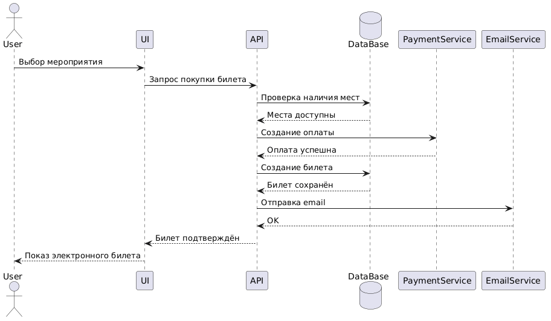
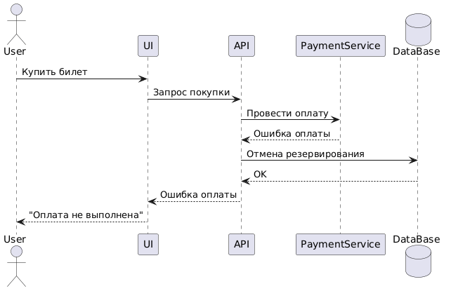

<p align="center">Министерство образования Республики Беларусь</p>
<p align="center">Учреждение образования</p>
<p align="center">"Брестский Государственный технический университет"</p>
<p align="center">Кафедра ИИТ</p>

<br><br><br><br><br><br>

<p align="center"><strong>Лабораторная работа №1</strong></p>
<p align="center"><strong>По дисциплине:</strong> "Проектирование интернет-систем"</p>
<p align="center"><strong>Тема:</strong> "Сценарий транзакции: моделирование use-case и границ ответственности"</p>

<br><br><br><br><br><br>

<p align="right"><strong>Выполнил:</strong></p>
<p align="right">Студент 3 курса</p>
<p align="right">Группы ПО-13</p>
<p align="right">Король А.В.</p>

<p align="right"><strong>Проверил:</strong></p>
<p align="right">Шорох Д.В.</p>

<br><br><br><br><br>

<p align="center"><strong>Брест 2026</strong></p>

---

# Цель работы

Научиться анализировать бизнес-процессы интернет-системы, выявлять границы ответственности компонентов и моделировать транзакционные сценарии с учётом возможных сбоев.

---

# Вариант №15 - Ивенты «Зафичь, идём?» 🎤

**Питч:** Мероприятие без бардака.

**Ядро домена:** События, Билеты, Участники, Расписание, Спикеры

---

# Ход выполнения работы

## 1. Структура проекта

```text
lab-01/
├── README.md
├── use-case.md
├── diagrams/
│   ├── sequence-happy.puml
│   ├── sequence-happy.png
│   ├── sequence-error-payment.puml
│   └── sequence-error-payment.png
├── scenarios.feature
└── analysis.md
```

---

## 2. Use-case описание

👉 **Ссылка на файл:** [use-case.md](use-case.md)

### Основной сценарий:

Покупка билета на мероприятие

### Первичный актор:

Пользователь (участник мероприятия)

### Цель:

Купить билет на выбранное мероприятие и получить подтверждение участия.

---

## Краткое описание основного потока

1. Пользователь открывает платформу «Зафичь, идём?».
2. Выбирает интересующее мероприятие.
3. Просматривает информацию о событии, расписании и спикерах.
4. Нажимает кнопку «Купить билет».
5. Система проверяет наличие свободных мест.
6. Пользователь вводит данные для оплаты.
7. Система отправляет запрос в платёжный сервис.
8. После успешной оплаты создаётся билет.
9. Система отправляет подтверждение на email пользователя.
10. Пользователь получает электронный билет.

---

## Альтернативные потоки

- Пользователь выбирает VIP-билет.
- Пользователь применяет промокод.
- Пользователь добавляет мероприятие в избранное.

---

## Исключительные ситуации

- Билеты закончились.
- Ошибка оплаты.
- Email-сервис недоступен.
- Пользователь не авторизован.

---

# 3. Диаграммы последовательности (Sequence Diagrams)

## 3.1 Happy Path (успешный сценарий)

👉 **PlantUML исходник:** [sequence-happy.puml](diagrams/sequence-happy.puml)



### Описание потока

- Пользователь выбирает мероприятие.
- Система проверяет наличие билетов.
- Пользователь оплачивает заказ.
- Создаётся билет.
- Email-сервис отправляет подтверждение.
- Пользователь получает электронный билет.

### Участники

- Авторизованный пользователь
- UI
- API
- PaymentService
- EmailService
- DataBase

---

## 3.2 Error Case (сценарий с ошибкой)

👉 **PlantUML исходник:** [sequence-error-payment.puml](diagrams/sequence-error-payment.puml)



### Описание потока

- Если платёж не проходит, билет не создаётся.
- Пользователь получает сообщение об ошибке.
- Место снова становится доступным.

---

# 4. Gherkin-сценарии

👉 **Ссылка на файл:** [scenarios.feature](scenarios.feature)

**Реализовано сценариев:** 5

## Список сценариев

1. ✅ Успешная покупка билета
2. ✅ Ошибка: Билеты закончились
3. ✅ Ошибка: Пользователь не авторизован
4. ✅ Ошибка: Сервис оплаты недоступен
5. ✅ Ошибка: Таймаут сервиса уведомлений

---

## Пример сценария

```gherkin
Feature: Покупка билета на мероприятие

  Scenario: Успешная покупка билета
    Given пользователь авторизован
    And мероприятие доступно
    When пользователь нажимает "Купить билет"
    And успешно оплачивает заказ
    Then система создаёт билет
    And отправляет подтверждение на email
```

---

### 5. Анализ границ ответственности

👉 **Ссылка на файл:** [analysis.md](analysis.md)

#### 5.1. Транзакционные границы

| Операция | Синхронная/Асинхронная | Откат при ошибке | Retry-стратегия | Идемпотентность |
|----------|------------------------|------------------|-----------------|-----------------|
| Проверка наличия билетов | Синхронная | Да (ROLLBACK транзакции) | Нет | Да (повторная проверка по event_id) |
| Создание билета в БД | Синхронная | Да (в рамках транзакции) | Нет | Да (проверка ticket_id) |
| Вызов Payment Service | Синхронная | Да (отмена покупки) | 3 попытки с экспоненциальной задержкой | Да (payment_intent_id) |
| Отправка email | Асинхронная | Нет (best-effort) | 5 попыток с backoff | Да (дедупликация по ticket_id) |
| Уведомление участников | Асинхронная | Нет (best-effort) | Повторная отправка через очередь | Да (по event_id + user_id) |

#### 5.2. Обработка исключительных ситуаций

**Реализовано стратегий обработки:** 3

**Примеры:**

##### Исключительная ситуация 1: Таймаут платёжного сервиса

- **Условие возникновения:** Платёжный сервис не ответил в течение 30 секунд при попытке оплаты билета.
- **Обнаружение:** HTTP-клиент выбрасывает TimeoutException; система логирует событие `"Payment timeout for ticket_id=12345"`.
- **Реакция:** Покупка переводится в статус `"PAYMENT_PENDING"`; запускается фоновая проверка статуса оплаты.
- **Компенсация:** Если через 10 минут платёж не подтверждён → бронь билета отменяется и место освобождается.
- **Уведомление пользователя:** Немедленно: `"Обработка платежа задерживается..."`; через 10 минут: `"Покупка билета отменена из-за неудачной оплаты"`.

##### Исключительная ситуация 2: Билеты закончились

- **Условие возникновения:** Пользователь пытается купить билет на мероприятие, где свободные места уже отсутствуют.
- **Обнаружение:** Проверка количества доступных билетов в БД возвращает значение `0`.
- **Реакция:** Система НЕ создаёт билет.
- **Компенсация:** Не требуется (операция не началась).
- **Уведомление пользователя:** `"Свободных билетов больше нет. Пожалуйста, выберите другое мероприятие."`

##### Исключительная ситуация 3: Таймаут сервиса уведомлений (Email)

- **Условие возникновения:** Email-сервис не отвечает в течение 10 секунд при отправке электронного билета.
- **Обнаружение:** API получает TimeoutException; логируется событие `"NotificationService timeout for ticket_id=12345"`.
- **Реакция:** Билет остаётся подтверждённым; уведомление ставится в очередь для повторной отправки.
- **Компенсация:** Не требуется (билет действителен).
- **Уведомление пользователя:** `"Билет успешно создан! Email будет отправлен позже."`

---

## Таблица критериев оценки

| Критерий | Баллы | Выполнено |
|----------|-------|-----------|
| Use-case описание (полнота: акторы, предусловия, основной поток, альтернативы, исключения) | 15 | ✅ |
| Sequence diagram (happy path) - корректность нотации UML, включение всех ключевых компонентов | 20 | ✅ |
| Sequence diagram (error case) - моделирование хотя бы одной исключительной ситуации | 15 | ✅ |
| Gherkin-сценарии - минимум 4 сценария (1 успешный + 3 ошибочных) | 20 | ✅ |
| Анализ границ ответственности - таблица транзакционных границ, обоснование выбора синхронных/асинхронных операций | 15 | ✅ |
| Обработка исключений - описание стратегий retry, компенсации, уведомлений | 10 | ✅ |
| Качество документации - оформление, читаемость, грамотность | 5 | ✅ |
| **ИТОГО** | **100** | |

---

## Контрольные вопросы

**Подготовка к защите:**

1. Что такое транзакционная граница? Где она проходит в вашем сценарии?
   - Транзакционная граница — это участок процесса, где операции выполняются атомарно и согласованно. 
   - В нашем сценарии она начинается при нажатии пользователем кнопки «Забронировать» и заканчивается фиксацией брони в базе данных и подтверждением оплаты.

2. Почему операция X выбрана синхронной, а Y - асинхронной?
   - Синхронные операции (создание брони, проверка слота, вызов платёжного сервиса) критичны для целостности данных и требуют немедленного результата. 
   - Асинхронные операции (отправка email, уведомления) не влияют на факт брони и могут выполняться позже без нарушения логики.

3. Как обеспечить идемпотентность при повторных запросах?
   - Использовать уникальные идентификаторы операций (idempotency key). 
   - Проверять статус уже выполненной операции перед созданием новой. 
   - При повторном запросе возвращать результат существующей операции вместо дублирования.

4. Что произойдёт, если внешний сервис вернёт ошибку после частичного выполнения операции?
   - Система переводит процесс в промежуточный статус. 
   - Запускается механизм компенсации: откат изменений или отмена операции. 
   - Пользователь получает уведомление о задержке или сбое.

5. Как система обнаружит, что внешний сервис недоступен?
   - По таймауту сетевого запроса или по коду ошибки (например, 503 Service Unavailable). 
   - Событие фиксируется в логах. 
   - Запускается стратегия повторных попыток или постановка задачи в очередь.

6. Какие данные нужно логировать для диагностики сбоев?
   - Уникальный идентификатор операции.  
   - Пользовательский контекст (например, ID пользователя).  
   - Тип операции и её параметры.  
   - Время и причина ошибки (timeout, отказ сервиса).  
   - Количество попыток повторного выполнения и их результат.  
   - Текущий статус операции.

---

# Ссылка на репозиторий

👉 **GitHub:** [репозиторий](https://github.com/SsoOmMtThHiInNgG/PIS-2026/blob/lab1/students/Korol_Artem/lab-01)

---

# Вывод

> В ходе выполнения лабораторной работы был проанализирован бизнес-процесс системы «Ивенты „Зафичь, идём?“ 🎤». Разработаны use-case сценарии, sequence diagrams и Gherkin-сценарии. Определены транзакционные границы и механизмы обработки ошибок. Получены навыки моделирования распределённых интернет-систем и анализа отказоустойчивости сервисов.

---

**Дата выполнения:** 09.04.2026

**Оценка:** _____________

**Подпись преподавателя:** _____________