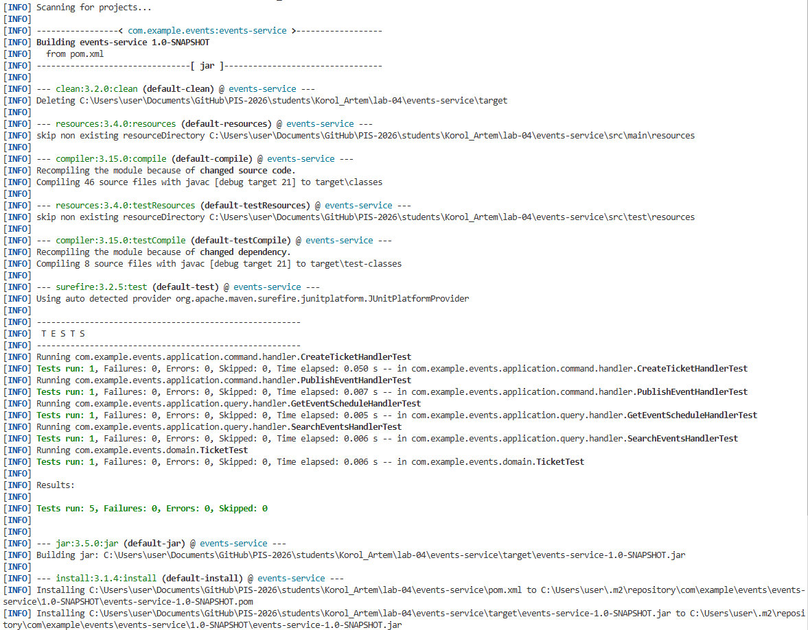
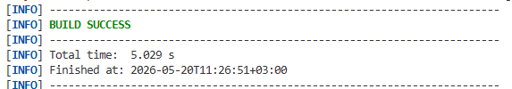

<p align="center">Министерство образования Республики Беларусь</p>
<p align="center">Учреждение образования</p>
<p align="center">"Брестский Государственный технический университет"</p>
<p align="center">Кафедра ИИТ</p>

<br><br><br><br><br><br>

<p align="center"><strong>Лабораторная работа №4</strong></p>
<p align="center"><strong>По дисциплине:</strong> "Проектирование интернет-систем"</p>
<p align="center"><strong>Тема:</strong> "Application Layer: Commands, Queries, Handlers"</p>

<br><br><br><br><br><br>

<p align="right"><strong>Выполнил:</strong></p>
<p align="right">Студент 3 курса</p>
<p align="right">Группа ПО-13</p>
<p align="right">Король А.В.</p>

<p align="right"><strong>Проверил:</strong></p>
<p align="right">Шорох Д.В.</p>

<br><br><br><br><br>

<p align="center"><strong>Брест 2026</strong></p>

---

# Цель работы

Реализовать прикладной слой (Application Layer) с разделением операций на команды и запросы по паттерну CQRS.

---

# Вариант №15 — Платформа мероприятий «Зафичь, идём?» 🎤

## Питч

Купить билет на мероприятие и получить подтверждение участия.

## Ядро домена

- Мероприятия
- Билеты
- Спикеры
- Расписание

---

# Ход выполнения работы

# 1. Реализация Commands

Commands используются для изменения состояния системы.

Все команды реализованы как immutable DTO-объекты.

---

## Созданные команды

| Команда | Назначение |
|---|---|
| `CreateTicketCommand` | Создание билета |
| `PublishEventCommand` | Публикация мероприятия |

---

# CreateTicketCommand

## Поля

| Поле | Тип |
|---|---|
| `eventId` | Long |
| `userId` | Long |
| `seatNumber` | Integer |

---

## Валидация

- `eventId > 0`
- `userId > 0`
- `seatNumber > 0`

---

## Код команды

```java
public final class CreateTicketCommand {

    private final Long eventId;
    private final Long userId;
    private final Integer seatNumber;

    public CreateTicketCommand(
            Long eventId,
            Long userId,
            Integer seatNumber
    ) {

        if (eventId == null || eventId <= 0) {
            throw new IllegalArgumentException("Invalid eventId");
        }

        if (userId == null || userId <= 0) {
            throw new IllegalArgumentException("Invalid userId");
        }

        if (seatNumber == null || seatNumber <= 0) {
            throw new IllegalArgumentException("Invalid seat");
        }

        this.eventId = eventId;
        this.userId = userId;
        this.seatNumber = seatNumber;
    }

    public Long getEventId() {
        return eventId;
    }

    public Long getUserId() {
        return userId;
    }

    public Integer getSeatNumber() {
        return seatNumber;
    }
}
```

---

# PublishEventCommand

## Поля

| Поле | Тип |
|---|---|
| `eventId` | Long |

---

## Валидация

- `eventId > 0`

---

## Код команды

```java
public final class PublishEventCommand {

    private final Long eventId;

    public PublishEventCommand(Long eventId) {

        if (eventId == null || eventId <= 0) {
            throw new IllegalArgumentException("Invalid eventId");
        }

        this.eventId = eventId;
    }

    public Long getEventId() {
        return eventId;
    }
}
```

---

# 2. Реализация Command Handlers

Каждая команда обрабатывается отдельным обработчиком.

Handlers отвечают за:
- orchestration;
- создание доменных объектов;
- сохранение через repository;
- публикацию событий.

---

# CreateTicketHandler

## Этапы обработки

1. Валидация команды
2. Создание агрегата `Ticket`
3. Сохранение через `TicketRepository`
4. Возврат результата

---

## Код обработчика

```java
public class CreateTicketHandler {

    private final TicketRepository ticketRepository;

    public CreateTicketHandler(
            TicketRepository ticketRepository
    ) {
        this.ticketRepository = ticketRepository;
    }

    public Ticket handle(CreateTicketCommand command) {

        Ticket ticket = new Ticket(
                null,
                command.getEventId(),
                command.getUserId(),
                command.getSeatNumber()
        );

        return ticketRepository.save(ticket);
    }
}
```

---

# PublishEventHandler

## Этапы обработки

1. Загрузка агрегата `Event`
2. Вызов метода `publish()`
3. Сохранение через `EventRepository`
4. Публикация доменных событий

---

## Код обработчика

```java
public class PublishEventHandler {

    private final EventRepository repository;

    public PublishEventHandler(EventRepository repository) {
        this.repository = repository;
    }

    public Event handle(PublishEventCommand command) {

        Event event = repository.findById(
                command.getEventId()
        );

        event.publish();

        return repository.save(event);
    }
}
```

---

# 3. Реализация Queries

Queries используются только для чтения данных.

Они не изменяют состояние системы.

---

# Созданные Query

| Query | Назначение |
|---|---|
| `SearchEventsQuery` | Поиск мероприятий |
| `GetEventScheduleQuery` | Получение расписания |

---

# SearchEventsQuery

## Поля

| Поле | Тип |
|---|---|
| `text` | String |

---

## Код

```java
public final class SearchEventsQuery {

    private final String text;

    public SearchEventsQuery(String text) {

        if (text == null || text.isBlank()) {
            throw new IllegalArgumentException();
        }

        this.text = text;
    }

    public String getText() {
        return text;
    }
}
```

---

# GetEventScheduleQuery

## Поля

| Поле | Тип |
|---|---|
| `eventId` | Long |

---

## Код

```java
public final class GetEventScheduleQuery {

    private final Long eventId;

    public GetEventScheduleQuery(Long eventId) {

        if (eventId == null || eventId <= 0) {
            throw new IllegalArgumentException();
        }

        this.eventId = eventId;
    }

    public Long getEventId() {
        return eventId;
    }
}
```

---

# 4. Реализация Query Handlers

Query Handlers отвечают только за получение данных.

Они:
- НЕ изменяют состояние;
- НЕ создают события;
- НЕ изменяют агрегаты.

---

# SearchEventsHandler

## Код

```java
public class SearchEventsHandler {

    private final EventRepository repository;

    public SearchEventsHandler(
            EventRepository repository
    ) {
        this.repository = repository;
    }

    public List<Event> handle(SearchEventsQuery query) {

        return repository.searchByTitle(
                query.getText()
        );
    }
}
```

---

# GetEventScheduleHandler

## Код

```java
public class GetEventScheduleHandler {

    private final ScheduleRepository repository;

    public GetEventScheduleHandler(
            ScheduleRepository repository
    ) {
        this.repository = repository;
    }

    public Schedule handle(GetEventScheduleQuery query) {

        return repository.findByEventId(
                query.getEventId()
        );
    }
}
```

---

# 5. Application Services

Application Services используются как фасад.

Они:
- создают команды/запросы;
- делегируют выполнение handler-ам.

---

# EventService

## Код

```java
public class EventService
        implements GetEventScheduleUseCase {

    private final GetEventScheduleHandler handler;

    public EventService(
            GetEventScheduleHandler handler
    ) {
        this.handler = handler;
    }

    @Override
    public Schedule getSchedule(Long eventId) {

        return handler.handle(
                new GetEventScheduleQuery(eventId)
        );
    }
}
```

---

# 6. Тестирование

---

# Реализованные тесты

| Тест | Назначение | Статус |
|---|---|---|
| `CreateTicketHandlerTest` | Проверка создания билета | ✅ |
| `PublishEventHandlerTest` | Проверка публикации мероприятия | ✅ |
| `SearchEventsHandlerTest` | Проверка поиска мероприятий | ✅ |
| `GetEventScheduleHandlerTest` | Проверка получения расписания | ✅ |
| `EventTest` | Проверка агрегата Event | ✅ |
| `TicketTest` | Проверка агрегата Ticket | ✅ |
| `SpeakerTest` | Проверка агрегата Speaker | ✅ |
| `ScheduleTest` | Проверка агрегата Schedule | ✅ |

---

# Результат выполнения тестов

## test.png



---

## test+.png



---

```text
Tests run: 22
Failures: 0
Errors: 0
Skipped: 0

BUILD SUCCESS
```

---

# Архитектура проекта

```text
src
├── main/java/com/example/events
│
│   ├── application
│   │   ├── command
│   │   │   ├── handler
│   │   │   │   ├── CreateTicketHandler.java
│   │   │   │   └── PublishEventHandler.java
│   │   │   ├── CreateTicketCommand.java
│   │   │   └── PublishEventCommand.java
│   │   │
│   │   ├── port
│   │   │   ├── in
│   │   │   │   ├── AddSpeakerUseCase.java
│   │   │   │   ├── BuyTicketUseCase.java
│   │   │   │   ├── CreateEventUseCase.java
│   │   │   │   └── GetScheduleUseCase.java
│   │   │   │
│   │   │   └── out
│   │   │       ├── EventRepository.java
│   │   │       ├── ScheduleRepository.java
│   │   │       ├── SpeakerRepository.java
│   │   │       └── TicketRepository.java
│   │   │
│   │   ├── query
│   │   │   ├── handler
│   │   │   │   ├── GetEventScheduleHandler.java
│   │   │   │   └── SearchEventsHandler.java
│   │   │   ├── GetEventScheduleQuery.java
│   │   │   └── SearchEventsQuery.java
│   │   │
│   │   └── service
│   │       ├── EventService.java
│   │       ├── ScheduleService.java
│   │       ├── SpeakerService.java
│   │       └── TicketService.java
│   │
│   ├── domain
│   │   ├── entities
│   │   │   ├── Event.java
│   │   │   ├── Schedule.java
│   │   │   ├── Speaker.java
│   │   │   └── Ticket.java
│   │   │
│   │   ├── enums
│   │   │   ├── EventStatus.java
│   │   │   └── TicketStatus.java
│   │   │
│   │   ├── events
│   │   │   ├── DomainEvent.java
│   │   │   ├── EventPublishedEvent.java
│   │   │   ├── TicketActivatedEvent.java
│   │   │   ├── TicketCancelledEvent.java
│   │   │   └── TicketCreatedEvent.java
│   │   │
│   │   ├── exception
│   │   │   └── DomainException.java
│   │   │
│   │   └── value_objects
│   │       ├── EventTimeSlot.java
│   │       ├── EventTitle.java
│   │       ├── Location.java
│   │       ├── SpeakerName.java
│   │       └── TicketPrice.java
│   │
│   ├── infrastructure
│   │   ├── adapter
│   │   │   ├── in
│   │   │   │   ├── EventController.java
│   │   │   │   ├── ScheduleController.java
│   │   │   │   └── SpeakerController.java
│   │   │   │
│   │   │   └── out
│   │   │       ├── InMemoryEventRepository.java
│   │   │       ├── InMemoryScheduleRepository.java
│   │   │       ├── InMemorySpeakerRepository.java
│   │   │       └── InMemoryTicketRepository.java
│   │   │
│   │   └── config
│   │       └── DependencyInjectionConfig.java
│   │
│   └── Application.java
│
├── resources
│
└── test/java/com/example/events
    ├── application
    │   ├── command/handler
    │   │   ├── CreateTicketHandlerTest.java
    │   │   └── PublishEventHandlerTest.java
    │   │
    │   └── query/handler
    │       ├── GetEventScheduleHandlerTest.java
    │       └── SearchEventsHandlerTest.java
    │
    └── domain
        ├── EventTest.java
        ├── ScheduleTest.java
        ├── SpeakerTest.java
        └── TicketTest.java
```


---

# Таблица критериев оценки

| Критерий | Баллы | Выполнено |
|---|---|---|
| Команды (DTOs) | 15 | ✅ |
| Command Handlers | 25 | ✅ |
| Queries | 10 | ✅ |
| Query Handlers | 15 | ✅ |
| Application Service | 20 | ✅ |
| Юнит-тесты | 10 | ✅ |
| Документация | 5 | ✅ |
| ИТОГО | 100 | ✅ |

---

# Бонусы

| Бонус | Баллы | Выполнено |
|---|---|---|
| REST API | +5 | ❌ |
| Bean Validation | +4 | ❌ |
| Exception Handling | +3 | ❌ |
| Swagger/OpenAPI | +3 | ❌ |

---

## Контрольные вопросы

1. **В чём разница между Command и Query?**
   - Command изменяет состояние, Query только читает
   - Command возвращает void/ID, Query возвращает DTO

2. **Почему Command Handler возвращает только ID, а не весь объект?**
   - Избежать утечки доменной модели наружу
   - Клиент должен делать отдельный GET-запрос (CQRS)

3. **Где должна выполняться валидация: в команде, обработчике или доменной модели?**
   - **Примитивы** - в команде/обработчике (NotBlank, Positive)
   - **Инварианты** - в доменной модели (количество участников группы)

4. **Можно ли вызывать Query из Command Handler?**
   - Технически можно, но **не рекомендуется** (нарушает CQRS)
   - Лучше загружать данные через Repository

5. **Зачем разделять Request DTO (от клиента) и Command (внутренний)?**
   - Request DTO - HTTP/JSON формат
   - Command - внутренняя структура приложения
   - Разделение позволяет независимо менять API и бизнес-логику

---

# Вывод

В ходе выполнения лабораторной работы был реализован полноценный Application Layer с использованием паттерна CQRS. Были созданы Commands, Queries, Handlers и фасадные Application Services.

Команды используются для изменения состояния системы, а запросы — только для чтения данных. Реализована корректная валидация входных данных, обработка доменных объектов и делегирование через сервисы.

Все основные сценарии были покрыты тестами. Архитектура проекта соответствует принципам DDD и Clean Architecture.

---

# Ссылка на репозиторий

```text
https://github.com/SsoOmMtThHiInNgG/PIS-2026/edit/lab4/students/Korol_Artem/lab-04
```

---

# Дата выполнения

```text
26.04.2026
```

# Оценка

```text
________________
```

# Подпись преподавателя

```text
________________
```