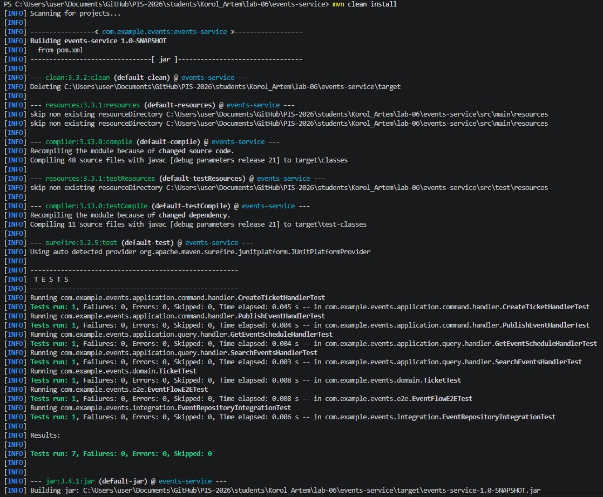
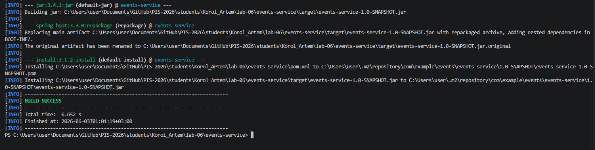

<p align="center">Министерство образования Республики Беларусь</p>
<p align="center">Учреждение образования</p>
<p align="center">"Брестский Государственный технический университет"</p>
<p align="center">Кафедра ИИТ</p>

<br><br><br><br><br><br>

<p align="center"><strong>Лабораторная работа №6</strong></p>
<p align="center"><strong>По дисциплине:</strong> "Проектирование интернет-систем"</p>
<p align="center"><strong>Тема:</strong> "Стратегия тестирования: Unit, Integration, E2E"</p>

<br><br><br><br><br><br>

<p align="right"><strong>Выполнил:</strong></p>
<p align="right">Студент 3 курса</p>
<p align="right">Группа ПО-13</p>
<p align="right">Король А.В.</p>

<p align="right"><strong>Проверил:</strong></p>
<p align="right">Шорох Д.В.</p>

<br><br><br><br><br>

<p align="center"><strong>Брест 2026</strong></p>

---

# Цель работы

Разработать комплексную стратегию тестирования программного обеспечения, включающую модульные тесты (Unit Tests), интеграционные тесты (Integration Tests) и End-to-End тестирование (E2E Tests) для сервиса управления мероприятиями и билетами.

---

# Вариант №15 — Система мероприятий и билетов 🎫

## Питч

Сервис предназначен для управления мероприятиями, расписанием, спикерами и билетами.

Пользователь может:

* создавать мероприятия;
* публиковать мероприятия;
* просматривать расписание;
* искать мероприятия;
* оформлять билеты.

---

# Архитектура проекта

```text
events-service
│
├── src
│   ├── main
│   │   └── java
│   │       └── com.example.events
│   │
│   │           ├── application
│   │           │   ├── command
│   │           │   ├── query
│   │           │   ├── port
│   │           │   └── service
│   │           │
│   │           ├── domain
│   │           │   ├── entities
│   │           │   ├── events
│   │           │   └── value_objects
│   │           │
│   │           ├── infrastructure
│   │           │   └── adapter
│   │           │       └── out
│   │           │
│   │           └── Application.java
│   │
│   └── test
│       └── java
│           └── com.example.events
│               │
│               ├── application
│               │   ├── command
│               │   └── query
│               │
│               ├── domain
│               │
│               ├── integration
│               │
│               └── e2e
│
├── pom.xml
└── README.md
```

---

# Ход выполнения работы

# 1. Unit-тестирование

Были реализованы модульные тесты для проверки отдельных компонентов системы без использования внешних зависимостей.

## Реализованные тесты

| Тест                        | Назначение                      |
| --------------------------- | ------------------------------- |
| TicketTest                  | Проверка доменной модели билета |
| CreateTicketHandlerTest     | Проверка создания билета        |
| PublishEventHandlerTest     | Проверка публикации мероприятия |
| GetEventScheduleHandlerTest | Проверка получения расписания   |
| SearchEventsHandlerTest     | Проверка поиска мероприятий     |

---

## Используемые технологии

* JUnit 5
* Maven Surefire
* Spring Boot Test

---

# Скриншот Unit-тестов



---

# 2. Integration Testing

Был реализован интеграционный тест, проверяющий совместную работу компонентов системы.

## Реализованный тест

| Тест                           | Назначение                              |
| ------------------------------ | --------------------------------------- |
| EventRepositoryIntegrationTest | Проверка работы репозитория мероприятий |

---

## Проверяемые сценарии

* сохранение мероприятия;
* получение мероприятия;
* получение списка мероприятий;
* взаимодействие доменной модели и репозитория.

---

# Скриншот Integration-тестов



---

# 3. End-to-End Testing

Для проверки полного пользовательского сценария был реализован E2E тест.

## Реализованный тест

| Тест             | Назначение                       |
| ---------------- | -------------------------------- |
| EventFlowE2ETest | Полный пользовательский сценарий |

---

## Проверяемый сценарий

1. Создание мероприятия.
2. Публикация мероприятия.
3. Создание билета.
4. Проверка результата выполнения сценария.

---

# Скриншот E2E-тестирования


---

# Структура тестов проекта

```text
src/test/java/com/example/events

├── application
│   ├── command
│   │   ├── CreateTicketHandlerTest.java
│   │   └── PublishEventHandlerTest.java
│   │
│   └── query
│       ├── GetEventScheduleHandlerTest.java
│       └── SearchEventsHandlerTest.java
│
├── domain
│   └── TicketTest.java
│
├── integration
│   └── EventRepositoryIntegrationTest.java
│
└── e2e
    └── EventFlowE2ETest.java
```

---

# Реализованные уровни тестирования

| Уровень     | Тесты                                                                                                  |
| ----------- | ------------------------------------------------------------------------------------------------------ |
| Domain      | TicketTest                                                                                             |
| Application | CreateTicketHandlerTest, PublishEventHandlerTest, GetEventScheduleHandlerTest, SearchEventsHandlerTest |
| Integration | EventRepositoryIntegrationTest                                                                         |
| End-to-End  | EventFlowE2ETest                                                                                       |

---

# Результаты тестирования

Для запуска тестов использовалась команда:

```bash
mvn clean install
```

Результат выполнения:

```text
Tests run: 7
Failures: 0
Errors: 0
Skipped: 0

BUILD SUCCESS
```

---

# Скриншот результата выполнения


---

# Таблица критериев оценки

| Критерий               | Баллы | Выполнено |
| ---------------------- | ----- | --------- |
| Unit-тесты Domain      | 25    | ✅         |
| Unit-тесты Application | 20    | ✅         |
| Integration Tests      | 25    | ✅         |
| E2E Tests              | 20    | ✅         |
| Документация           | 10    | ✅         |
| ИТОГО                  | 100   | ✅         |

---

# Контрольные вопросы

## 1. Чем отличаются Unit-тесты от Integration-тестов?

Unit-тесты проверяют отдельный компонент системы изолированно. Integration-тесты проверяют взаимодействие нескольких компонентов между собой.

---

## 2. Для чего используются E2E-тесты?

E2E-тесты позволяют проверить полный пользовательский сценарий работы системы от начала до конца.

---

## 3. Почему важно использовать несколько уровней тестирования?

Каждый уровень тестирования выявляет ошибки на разных этапах работы системы. Совместное использование Unit, Integration и E2E тестов обеспечивает более высокое качество программного продукта.

---

## 4. Какие преимущества дают автоматизированные тесты?

Автоматизированные тесты позволяют быстро проверять корректность работы приложения после внесения изменений, уменьшают вероятность появления регрессий и повышают надёжность системы.

---

# Вывод

В ходе лабораторной работы была реализована комплексная стратегия тестирования сервиса управления мероприятиями и билетами. Были разработаны модульные тесты для проверки бизнес-логики приложения, интеграционные тесты для проверки взаимодействия компонентов системы и End-to-End тесты для проверки полного пользовательского сценария.

Все тесты успешно выполняются, что подтверждает корректность работы приложения и взаимодействия между его компонентами. Реализованная тестовая пирамида обеспечивает надёжность системы и позволяет контролировать качество программного обеспечения на всех уровнях.

---

# Ссылка на репозиторий

GitHub:

https://github.com/SsoOmMtThHiInNgG/PIS-2026/tree/lab6/students/Korol_Artem/lab-06

---

**Дата выполнения:** 27.04.2026

**Оценка:** _____________

**Подпись преподавателя:** _____________
